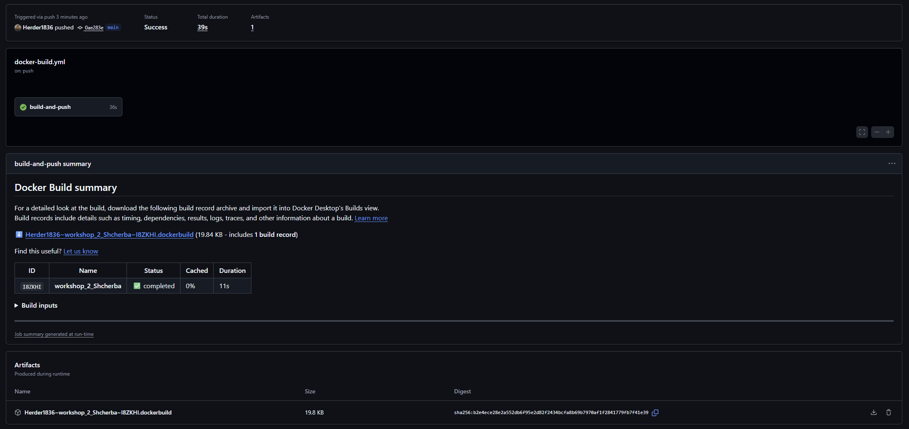
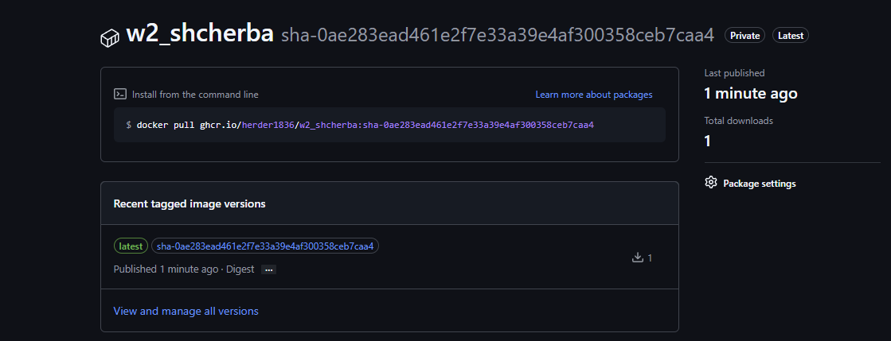
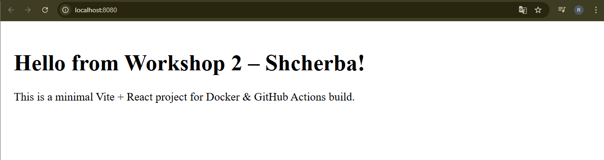

# 🚀 Workshop 2 — Docker + GitHub Actions + GHCR Deployment

Цей проєкт демонструє повний автоматизований цикл збірки Frontend застосунку (Vite + React) за допомогою Docker та GitHub Actions з подальшою публікацією образу у GitHub Container Registry (GHCR).

## Посилання на пройдені практичні роботи:

## [Hello GitHub Actions](https://github.com/Herder1836/skills-publish-packages) 

## [Publish Packages](https://github.com/Herder1836/skills-hello-github-actions) 

## 📦 Стек технологій
- **Vite + React**
- **Docker**
- **Nginx**
- **GitHub Actions**
- **GitHub Container Registry (GHCR)**

## 🧱 Структура проєкту
```
/
├─ src/
├─ public/
├─ Dockerfile
└─ .github/workflows/docker-build.yml
```

## 🐳 Dockerfile (Multi-Stage)
```dockerfile
FROM node:18-alpine AS build
WORKDIR /app

COPY package.json package-lock.json ./
RUN npm install

COPY . .
RUN npm run build

FROM nginx:alpine
COPY --from=build /app/dist /usr/share/nginx/html

EXPOSE 80
CMD ["nginx", "-g", "daemon off;"]
```

## 🔁 GitHub Actions Workflow
```yaml
name: Build and Push Frontend Docker Image

on:
  workflow_dispatch:
  push:
    branches:
      - main
      - 'feature/*'

jobs:
  build-and-push:
    runs-on: ubuntu-latest

    steps:
      - name: Checkout repository
        uses: actions/checkout@v4

      - name: Log in to GitHub Container Registry
        uses: docker/login-action@v3
        with:
          registry: ghcr.io
          username: herder1836
          password: ${{ secrets.GHCR_PAT }}

      - name: Build and push Docker image
        uses: docker/build-push-action@v6
        with:
          context: .
          file: ./Dockerfile
          push: true
          tags: |
            ghcr.io/herder1836/w2_shcherba:latest
            ghcr.io/herder1836/w2_shcherba:sha-${{ github.sha }}
```

## 🔐 Секрети GHCR
Потрібен секрет:
```
GHCR_PAT
```
З правами:
- read:packages
- write:packages
- delete:packages (опц.)
- repo / public_repo

## 🐳 Запуск контейнера локально
```bash
docker pull ghcr.io/herder1836/w2_shcherba:latest
docker run -p 8080:80 ghcr.io/herder1836/w2_shcherba:latest
```

## 📷 Місця для скріншотів

### CI/CD успішний запуск

<p align="center"> 
  
</p>

### GHCR пакет

<p align="center"> 
  
</p>

### Docker Desktop контейнер

<p align="center"> 
  
</p>

### Браузер

<p align="center"> 
  
</p>

## 🧾 Висновок

У ході виконання роботи було налаштовано повний процес автоматичної збірки та публікації фронтенд-застосунку за допомогою Docker та GitHub Actions. Створений мультистейдж Dockerfile дає змогу зібрати Vite + React застосунок і розгорнути його через Nginx у вигляді оптимізованого контейнера.

Було розроблено GitHub Actions workflow, який автоматично виконує збірку та публікацію Docker-образу до GitHub Container Registry (GHCR) під час пушу до гілок `main` або `feature/*`. Створений персональний токен забезпечив успішну автентифікацію та публікацію образів. Кожна збірка позначається тегами `latest` та `sha-<commit>`, що значно полегшує контроль версій.

Після публікації образ протестовано локально: контейнер успішно запускається, Nginx коректно обслуговує статичні файли, а застосунок відображається у браузері без помилок. Це підтверджує правильність налаштування Dockerfile і CI/CD пайплайну.

Таким чином, усі поставлені завдання були виконані: реалізовано автоматизацію збірки, контейнеризацію, публікацію та запуск застосунку. Отриманий результат може бути використаний як основа для подальших DevOps-проєктів та удосконалення процесів розгортання.
